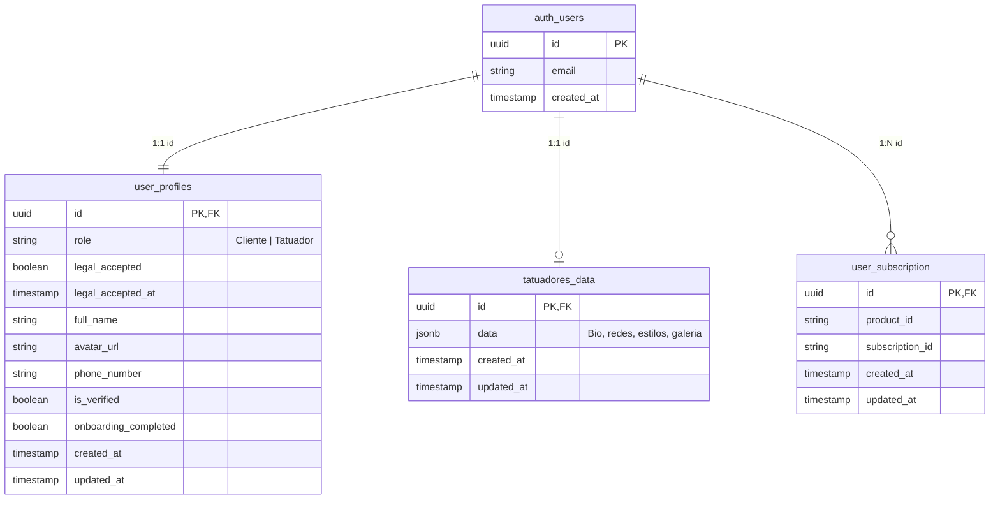

# 🎨 Tattoo Shop — E-Commerce & Artist Management Platform

[](#)
[](#)
[](#)
[](file:///c:/Users/giova/OneDrive/Documentos/proyectos/tattoo-shop/frontend/LICENSE)

Plataforma web integral para la digitalización de estudios de tatuajes y artistas independientes. Conecta a clientes con tatuadores profesionales, permitiendo explorar catálogos de arte, agendar citas, gestionar perfiles clínicos/estéticos, procesar pagos de depósitos y suscripciones, y garantizar el cumplimiento normativo mediante un sistema de consentimiento legal auditado.

---

## 📑 Tabla de Contenidos

1. [Visión General y Evolución del Proyecto](#-visión-general-y-evolución-del-proyecto)
2. [Estructura del Repositorio](#-estructura-del-repositorio)
3. [Características Principales](#-características-principales)
4. [Stack Tecnológico](#-stack-tecnológico)
5. [Arquitectura de Base de Datos y Supabase](#-arquitectura-de-base-de-datos-y-supabase)
6. [Catálogo de Endpoints de la API REST](#-catálogo-de-endpoints-de-la-api-rest)
7. [Suite de Pruebas Automatizadas (E2E)](#-suite-de-pruebas-automatizadas-e2e)
8. [Variables de Entorno y Configuración](#-variables-de-entorno-y-configuración)
9. [Guía de Instalación y Puesta en Marcha](#-guía-de-instalación-y-puesta-en-marcha)
10. [Despliegue y Contenedores (Docker / Podman / Vercel)](#-despliegue-y-contenedores-docker--podman--vercel)
11. [Seguridad y Políticas de `.gitignore`](#-seguridad-y-políticas-de-gitignore)

---

## 💡 Visión General y Evolución del Proyecto

El repositorio cuenta con dos etapas evolutivas claramente diferenciadas:

| Aspecto | Versión Base (V1 - Legacy) | Versión Moderna (V2 - Modern) |
| :--- | :--- | :--- |
| **Ubicación** | `/frontend` y `/backend/backend` | `/v2/frontend`, `/v2/backend`, `/v2/e2e` |
| **Frontend** | Vanilla JS (ES6+), HTML5, SASS/CSS3 | React 18, TypeScript, Vite, Tailwind CSS |
| **Backend** | Node.js + Express (JavaScript CJS) | Node.js + Express + TypeScript, Arquitectura por Capas |
| **Base de Datos** | Supabase básico con credenciales públicas | Supabase PostgreSQL con RLS avanzado, triggers y migraciones |
| **Autenticación** | Login / Registro manual con GoTrue | Híbrido (Email + Google OAuth) con onboarding legal auditado |
| **Pruebas** | Pruebas manuales | Suite E2E con 4 niveles (Coverage, Boundary, Integration, E2E) |
| **Despliegue** | Dockerfile / Nginx / Node Alpine | Configuración Serverless para Vercel + Docker / Podman |

---

## 📂 Estructura del Repositorio

```plaintext
tattoo-shop/
├── .agents/                 # Registros de contexto y orquestación de agentes IA
├── backend/
│   └── backend/             # [V1] Backend legacy (Express, JavaScript)
│       ├── app.js           # Servidor principal V1
│       ├── auth.js          # Rutas de autenticación legacy
│       ├── paypal.js        # Integración básica con PayPal
│       ├── mail.js          # Servicio de correos Nodemailer
│       ├── tattoo.js        # Consultas al catálogo
│       └── Dockerfile       # Contenedor Node.js para backend legacy
├── frontend/                # [V1] Frontend legacy (Vanilla JS, HTML5, CSS)
│   ├── Pages/               # Páginas HTML (Login, Registro, Dashboard, Suscripción)
│   ├── JS/                  # Lógica en JavaScript puro
│   ├── Design/              # Estilos CSS y preprocesadores SASS
│   ├── Img/                 # Recursos multimedia estáticos
│   └── Dockerfile           # Servidor web Nginx para frontend legacy
├── v2/                      # [V2] Aplicación moderna re-arquitecturada en TypeScript
│   ├── backend/             # API REST moderna (Express + TypeScript)
│   │   ├── migrations/      # Migraciones SQL para PostgreSQL en Supabase
│   │   │   ├── 01_init.sql                 # Tablas base, triggers y buckets
│   │   │   ├── 02_rls_security_policies.sql # Políticas de Row Level Security (RLS)
│   │   │   └── 03_user_profiles.sql        # Tabla user_profiles, roles y auditoría legal
│   │   ├── src/
│   │   │   ├── config/      # Configuración de clientes (Supabase Admin, env vars)
│   │   │   ├── controllers/ # Controladores HTTP (Auth, User, Mail, Tattoo, Subscription)
│   │   │   ├── middlewares/ # Autenticación JWT, validadores y manejo de errores
│   │   │   ├── routes/      # Enrutadores modulares de Express
│   │   │   ├── services/    # Lógica de negocio desacoplada
│   │   │   ├── templates/   # Plantillas HTML responsivas para emails
│   │   │   └── types/       # Definiciones de tipos e interfaces TypeScript
│   │   ├── api/             # Handler serverless para despliegue en Vercel
│   │   ├── package.json
│   │   ├── tsconfig.json
│   │   └── vercel.json
│   ├── frontend/            # SPA moderna (React 18 + Vite + Tailwind CSS)
│   │   ├── public/          # Assets públicos estáticos
│   │   ├── src/
│   │   │   ├── api/         # Clientes Axios y cliente Supabase configurado
│   │   │   ├── components/  # Componentes reutilizables y modales (OnboardingModal, etc.)
│   │   │   ├── context/     # AuthContext (Sesión, roles, intercepción de onboarding)
│   │   │   ├── pages/       # Vistas (Home, Login, Register, Dashboard, ArtistsHub, etc.)
│   │   │   │   └── legal/   # Páginas legales (TermsAndConditions, PrivacyPolicy)
│   │   │   ├── styles/      # Configuración de Tailwind y estilos globales
│   │   │   ├── types/       # Tipado TypeScript unificado
│   │   │   ├── App.tsx      # Configuración de rutas y guards de autenticación
│   │   │   └── main.tsx     # Punto de entrada de la aplicación React
│   │   ├── package.json
│   │   ├── vite.config.ts
│   │   └── vercel.json
│   └── e2e/                 # Framework de pruebas automatizadas end-to-end
│       ├── framework/       # Cliente API de prueba y utilidades de aserción
│       ├── tier1_feature_coverage/ # Pruebas de cobertura funcional básica
│       ├── tier2_boundary_corner/  # Pruebas de casos borde y validaciones de seguridad
│       ├── tier3_cross_feature/    # Pruebas de integración entre módulos
│       ├── tier4_real_world/       # Flujos completos de usuario en escenarios reales
│       ├── run_tests.ts     # Runner TypeScript de pruebas E2E
│       └── TEST_INFRA.md    # Especificación de la infraestructura de pruebas
├── compose-dev.yaml         # Configuración para Docker Dev Environments
├── Comandos para Podman.txt # Recetario de comandos para despliegue con Podman
├── .gitignore               # Exclusión integral de secretos, dist y temporales
├── AGENT.md                 # Tareas y directrices de trabajo para agentes
├── GEMINI.md                # Reglas del espacio de trabajo
└── MEMORY.md                # Bitácora de memoria persistente del proyecto
```

---

## ✨ Características Principales

### 👤 Para Clientes
- **Catálogo Visual Dinámico:** Filtrado por estilos (Realismo, Blackwork, Neotradicional, Minimalista, etc.).
- **Directorio de Artistas (Artists Hub):** Exploración de tatuadores con ubicación geográfica en mapas interactivos ([Leaflet](https://leafletjs.com/)), calificación, bio y acceso a su portafolio completo.
- **Perfil de Cliente Personalizado:**
  - Registro de historial de tatuajes realizados.
  - Ficha médica preventiva: alergias, condiciones cutáneas, tipo de piel y notas para el tatuador.
  - Instrucciones y seguimiento de cuidado posterior (*aftercare*).
- **Gestión de Citas y Pagos:** Reserva de sesiones con pagos de depósitos o abonos procesados de forma segura a través de PayPal.

### 🖋️ Para Tatuadores y Estudios
- **Perfil Profesional Público:** Exhibición de portafolio de alta resolución sincronizado con Supabase Storage.
- **Gestión de Disponibilidad:** Configuración de agenda y días disponibles para sesiones.
- **Verificación Profesional:** Distintivo de tatuador verificado (`is_verified`) para transmitir confianza a los clientes.
- **Suscripciones y Membresías:** Planes para estudios y artistas independientes administrados mediante suscripciones recurrentes de PayPal.

### 🛡️ Autenticación Híbrida y Onboarding Legal Auditado
- **Múltiples Métodos de Acceso:** Login mediante correo/contraseña y Social Login con Google OAuth.
- **Redirección Dinámica:** Configuración enrutada con `window.location.origin` que garantiza que los callbacks de autenticación funcionen tanto en desarrollo local como en producción (evitando saltos a `localhost` en Vercel).
- **Onboarding Interceptado Obligatorio:** Al iniciar sesión por primera vez (especialmente usuarios nuevos provenientes de Google OAuth), el sistema bloquea el acceso con un modal interactivo que exige:
  1. Elección explícita de su rol: **Cliente** o **Tatuador**.
  2. Lectura y aceptación obligatoria de los **Términos y Condiciones** y de la **Política de Privacidad**.
- **Trazabilidad Legal en Base de Datos:** Los registros guardan `legal_accepted = true` junto con la marca temporal exacta en UTC (`legal_accepted_at`) para garantizar validez jurídica y auditoría.

---

## 🛠️ Stack Tecnológico

### Frontend (v2)
- **Framework:** [React 18](https://react.dev/) + [Vite](https://vitejs.dev/)
- **Lenguaje:** [TypeScript 5](https://www.typescriptlang.org/)
- **Estilos:** [Tailwind CSS 3](https://tailwindcss.com/) + PostCSS + Autoprefixer
- **Iconografía:** [Lucide React](https://lucide.dev/)
- **Enrutamiento:** [React Router DOM v6](https://reactrouter.com/)
- **Geolocalización:** Leaflet & React-Leaflet
- **Códigos QR:** `qrcode.react` (para verificación de comprobantes y citas)

### Backend (v2)
- **Entorno:** [Node.js](https://nodejs.org/) (versión 18 o superior recomendada)
- **Framework:** [Express 4](https://expressjs.com/)
- **Lenguaje:** TypeScript (ejecución rápida con `tsx`, compilación con `tsc`)
- **Base de Datos / BaaS:** [@supabase/supabase-js](https://supabase.com/docs/reference/javascript/introduction)
- **Correos Transaccionales:** [Nodemailer](https://nodemailer.com/) con plantillas HTML responsivas
- **Pagos:** PayPal REST API (v2 Checkout y Subscriptions)
- **Manipulación de Archivos:** `base64-arraybuffer` para subida de imágenes a Supabase Storage

### Infraestructura y DevOps
- **Contenedores:** Docker, Podman (Pods compartidos en red)
- **Hosting / Serverless:** Vercel (Frontend SPA + Backend Express adaptado)
- **Base de Datos:** PostgreSQL en Supabase Cloud / Supabase Self-Hosted Docker

---

## 🗄️ Arquitectura de Base de Datos y Supabase

El modelo de datos se gestiona mediante migraciones SQL ubicadas en [v2/backend/migrations](file:///c:/Users/giova/OneDrive/Documentos/proyectos/tattoo-shop/v2/backend/migrations):



### Detalle de las Migraciones SQL
1. **[01_init.sql](file:///c:/Users/giova/OneDrive/Documentos/proyectos/tattoo-shop/v2/backend/migrations/01_init.sql):**
   - Habilita la extensión `uuid-ossp`.
   - Crea `public.tatuadores_data` con columna `JSONB` indexada mediante GIN para búsquedas ultra rápidas de portafolio y redes.
   - Crea `public.user_subscription` para vinculación con suscripciones de PayPal.
   - Configura la función y triggers automáticos `handle_updated_at()`.
   - Crea el bucket de almacenamiento público `user_profile` en Supabase Storage.
2. **[02_rls_security_policies.sql](file:///c:/Users/giova/OneDrive/Documentos/proyectos/tattoo-shop/v2/backend/migrations/02_rls_security_policies.sql):**
   - Habilita Row Level Security (RLS) en todas las tablas sensibles.
   - Reglas estrictas: los clientes solo pueden ver y editar sus propios datos; los perfiles de artistas permiten lectura pública para alimentar el catálogo.
3. **[03_user_profiles.sql](file:///c:/Users/giova/OneDrive/Documentos/proyectos/tattoo-shop/v2/backend/migrations/03_user_profiles.sql):**
   - Crea `public.user_profiles` vinculado a `auth.users(id)`.
   - Campos de control: `role` ('Cliente', 'Tatuador'), `legal_accepted`, `legal_accepted_at`, `full_name`, `avatar_url`, `phone_number`, `is_verified` y `onboarding_completed`.
   - Triggers automáticos para crear perfil inicial sincronizado al registrarse en `auth.users`.

---

## 📡 Catálogo de Endpoints de la API REST

Prefijo base: `/api`

### 1. Autenticación (`/api/auth`)
| Método | Endpoint | Descripción | Body Requerido / Notas |
| :--- | :--- | :--- | :--- |
| `POST` | `/api/auth/register` | Registro de usuario nuevo | `{ email, password, full_name, role, legal_accepted }` |
| `POST` | `/api/auth/login` | Inicio de sesión con credenciales | `{ email, password }` |
| `POST` | `/api/auth/logout` | Cierre de sesión y revocación | Token Bearer en Header |
| `POST` | `/api/auth/recover-password` | Envío de enlace para restablecer clave | `{ email }` |
| `POST` | `/api/auth/update-password` | Actualización de contraseña | `{ new_password }` con sesión activa |

### 2. Gestión de Usuarios y Onboarding (`/api/users`)
| Método | Endpoint | Descripción | Body Requerido / Notas |
| :--- | :--- | :--- | :--- |
| `GET` | `/api/users/profile` | Obtiene el perfil del usuario autenticado | Requiere Bearer Token |
| `PATCH` | `/api/users/role` | Actualiza el rol del usuario | `{ role: "Cliente" \| "Tatuador" }` |
| `POST` | `/api/users/onboarding` | Completa el onboarding inicial | `{ role, legal_accepted, full_name }` |
| `POST` | `/api/users/legal` | Registra la aceptación legal | `{ legal_accepted: true }` |

### 3. Catálogo y Tatuajes (`/api/tattoos`)
| Método | Endpoint | Descripción | Body Requerido / Notas |
| :--- | :--- | :--- | :--- |
| `GET` | `/api/tattoos` | Consulta el catálogo público de tatuajes | Soporta filtros por estilo y artista |
| `POST` | `/api/tattoos/upload` | Carga un nuevo diseño al portafolio | `{ imageBase64, title, style, artistId }` |

### 4. Suscripciones y Pagos (`/api/subscriptions`)
| Método | Endpoint | Descripción | Body Requerido / Notas |
| :--- | :--- | :--- | :--- |
| `POST` | `/api/subscriptions/create-order` | Crea una orden de pago en PayPal | `{ amount, currency, description }` |
| `POST` | `/api/subscriptions/capture-order` | Captura y confirma un pago de PayPal | `{ orderId }` |
| `POST` | `/api/subscriptions/subscribe` | Asocia una suscripción recurrente | `{ subscriptionId, planId }` |

### 5. Notificaciones por Correo (`/api/mail`)
| Método | Endpoint | Descripción | Body Requerido / Notas |
| :--- | :--- | :--- | :--- |
| `POST` | `/api/mail/send` | Envío de correos transaccionales | `{ to, subject, templateType, data }` |

---

## 🧪 Suite de Pruebas Automatizadas (E2E)

Ubicada en [v2/e2e](file:///c:/Users/giova/OneDrive/Documentos/proyectos/tattoo-shop/v2/e2e), esta suite valida rigurosamente la integridad de la API y de los flujos de usuario antes de cualquier despliegue.

### Niveles de Prueba (*Testing Tiers*):
1. **Tier 1 — Feature Coverage:** Pruebas unitarias y funcionales para los endpoints de Auth, selección de rol, onboarding legal y sincronización de perfiles.
2. **Tier 2 — Boundary & Corner Cases:** Validación de límites (contraseñas débiles, tokens JWT expirados o malformados, valores nulos, inyecciones de parámetros).
3. **Tier 3 — Cross-Feature Integration:** Pruebas combinadas (Registro -> Onboarding -> Cambio de rol -> Subida de diseño a Storage -> Solicitud de cita).
4. **Tier 4 — Real World Scenarios:** Emulación del comportamiento de un cliente y un tatuador en simultáneo.

### Ejecución de Pruebas:
```bash
# Entrar al directorio de pruebas
cd v2/e2e

# Instalar dependencias del runner
npm install

# Ejecutar la suite completa con Node / TypeScript
npm run test
# O mediante PowerShell en Windows:
./run_tests.ps1
```

---

## 🔐 Variables de Entorno y Configuración

> [!CAUTION]
> **Nunca hagas commit de archivos `.env` reales, tokens o credenciales privadas al repositorio.** Usa los archivos `.env.example` como plantilla.

### Backend V2 (`v2/backend/.env`)
| Variable | Descripción | Valor de Ejemplo |
| :--- | :--- | :--- |
| `PORT` | Puerto de escucha del servidor Express | `8080` |
| `SUPABASE_URL` | URL de tu proyecto en Supabase | `https://xxxx.supabase.co` |
| `ANON_KEY` | Llave anónima pública de Supabase | `eyJhbGciOi...` |
| `SERVICE_ROLE_KEY` | Llave privada de servicio (Admin) para bypass de RLS en backend | `eyJhbGciOi...` |
| `PAYPAL_KEY` | Secreto de la API de PayPal (sandbox o live) | `EHCODB0L...` |
| `PAYPAL_ID` | Client ID de la aplicación en PayPal Developer | `AX-_teHER...` |
| `EMAIL` | Cuenta de correo SMTP para Nodemailer | `tu-estudio@gmail.com` |
| `PASSW` | Contraseña de aplicación SMTP (Google App Password) | `xxxx yyyy zzzz wwww` |

### Frontend V2 (`v2/frontend/.env`)
| Variable | Descripción | Valor de Ejemplo |
| :--- | :--- | :--- |
| `VITE_API_URL` | URL base del backend Express | `http://localhost:8080` |
| `VITE_SUPABASE_URL` | URL de Supabase para cliente de React | `https://xxxx.supabase.co` |
| `VITE_SUPABASE_ANON_KEY`| Llave pública anónima de Supabase | `eyJhbGciOi...` |

---

## 🚀 Guía de Instalación y Puesta en Marcha

### Prerrequisitos
- **Node.js:** Versión 18.x o superior instalada.
- **npm:** Versión 9.x o superior.
- **Git** instalado.
- Cuenta de **Supabase** (o instancia local de PostgreSQL/Docker).

---

### Opción A: Ejecutar la Versión V2 (Recomendada)

#### 1. Configurar la Base de Datos
1. Entra a tu proyecto en [Supabase Dashboard](https://supabase.com/dashboard).
2. Abre el **SQL Editor**.
3. Ejecuta secuencialmente los scripts ubicados en `v2/backend/migrations/`:
   - `01_init.sql`
   - `02_rls_security_policies.sql`
   - `03_user_profiles.sql`

#### 2. Levantar el Backend (V2)
```bash
# 1. Navegar a la carpeta del backend
cd v2/backend

# 2. Instalar dependencias
npm install

# 3. Crear el archivo .env a partir del ejemplo
cp .env.example .env
# Configura tus credenciales reales en .env

# 4. Iniciar el servidor en modo desarrollo
npm run dev
# El servidor estará activo en http://localhost:8080
```

#### 3. Levantar el Frontend (V2)
```bash
# 1. En una nueva terminal, navegar al frontend
cd v2/frontend

# 2. Instalar dependencias
npm install

# 3. Crear el archivo .env a partir del ejemplo
cp .env.example .env

# 4. Iniciar Vite en modo desarrollo
npm run dev
# La aplicación abrirá en http://localhost:5173
```

---

### Opción B: Ejecutar la Versión V1 (Legacy)

#### 1. Backend V1
```bash
cd backend/backend
npm install
npm run dev
# Servidor escuchando en el puerto configurado (ej. 3100)
```

#### 2. Frontend V1
- Abre la carpeta `frontend` en Visual Studio Code.
- Haz clic derecho sobre `Pages/index.html` y selecciona **Open with Live Server**.
- Asegúrate de contar con un compilador de SASS si deseas editar los estilos en `frontend/Design`.

---

## 🐳 Despliegue y Contenedores (Docker / Podman / Vercel)

El proyecto incluye soporte para múltiples estrategias de contenedorización y despliegue:

### 1. Despliegue con Docker / Podman
Encuentra comandos detallados en [Comandos para Podman.txt](file:///c:/Users/giova/OneDrive/Documentos/proyectos/tattoo-shop/Comandos%20para%20Podman.txt).

```bash
# Ejemplo: Construcción y ejecución del Frontend con Docker
cd frontend
docker build -t frontend-app .
docker run -d --name frontend-container -p 8080:80 frontend-app

# Ejemplo: Construcción y ejecución del Backend
cd backend/backend
docker build -t backend-app .
docker run -d --name backend-container -p 3100:3100 backend-app
```

### 2. Despliegue en Pods de Podman (`tootienda`)
```bash
podman pod create --name tootienda -p 8080:80 -p 3100:3100
podman run -d --pod tootienda --name frontend-c frontend-app
podman run -d --pod tootienda --name backend-c backend-app
```

### 3. Despliegue en Vercel
Ambos proyectos (`v2/frontend` y `v2/backend`) cuentan con archivos `vercel.json` preconfigurados:
- **Frontend V2:** Configurado para enrutar todas las peticiones a `index.html` (SPA Routing).
- **Backend V2:** Configurado con la función serverless de entrada en `api/index.ts`.

---

## 🛡️ Seguridad y Políticas de `.gitignore`

El archivo [.gitignore](file:///c:/Users/giova/OneDrive/Documentos/proyectos/tattoo-shop/.gitignore) raíz está configurado bajo estándares estrictos para evitar fugas de información y código basura:

1. **Exclusión de Secretos y Llaves Privadas:**
   - `.env`, `.env.*` (excepto `.env.example`).
   - Archivos de volcado de claves como `DOTENV_Supabase.txt` o `DOTENV*`.
   - Certificados y llaves criptográficas (`*.pem`, `*.key`, `*.pfx`, `*.p12`).
   - Credenciales de cuentas de servicio (`*serviceAccount*.json`, `credentials.json`).
2. **Exclusión de Artefactos y Salidas de Compilación:**
   - Carpetas de compilación (`dist/`, `build/`, `out/`).
   - Salidas intermedias de TypeScript (`*.tsbuildinfo`).
3. **Exclusión de Dependencias y Temporales:**
   - `node_modules/` en todos los niveles.
   - Logs de NPM, Yarn y depuración (`*.log`).
   - Informes de cobertura y resultados de pruebas (`coverage/`, `results.json`).
4. **Archivos del Sistema y Editores:**
   - Archivos de Windows (`Thumbs.db`, `Desktop.ini`).
   - Archivos de macOS (`.DS_Store`).
   - Configuraciones privadas de editores (`.idea/`, `.vscode/*` excluyendo configuraciones compartidas).

> [!TIP]
> Si anteriormente se versionó por error algún archivo sensible o carpeta de compilación (`dist`), puedes removerlo del seguimiento de Git sin eliminarlo de tu disco local ejecutando:
> ```bash
> git rm -r --cached v2/frontend/dist
> git rm --cached backend/backend/.env
> git rm --cached DOTENV_Supabase.txt
> git commit -m "chore: remover archivos sensibles y compilados del seguimiento de git"
> ```

---

## 👥 Contribución y Buenas Prácticas

1. **Ramas de Trabajo:** Crea ramas descriptivas (`feature/nueva-funcionalidad`, `fix/correccion-error`).
2. **Tipado Estricto:** En `v2`, evita el uso de `any` y mantén las interfaces tipadas en sus respectivas carpetas `types/`.
3. **Verificación Previa:** Ejecuta la suite de pruebas E2E (`npm run test` en `v2/e2e`) antes de enviar cambios al repositorio remoto.
4. **Consultas y Políticas:** Cualquier nueva tabla en Supabase debe contar obligatoriamente con Row Level Security (RLS) habilitado.

---

*Desarrollado para la comunidad de artistas y apasionados del tatuaje.* 🖋️⚡
